# Architecture Dependency Audit

This document maps every dependency in the Milk Tea compiler core (`lib/milk_tea/core/`)
and identifies the leaks that prevent clean stage separation.

## 1. Current Load Order

Defined in `lib/milk_tea/core.rb:5-24`:

```
01. token.rb
02. token_stream.rb
03. lexer.rb            (uses Token, TriviaToken from token.rb)
04. cst.rb              (Data.define only)
05. cst_builder.rb      (uses Lexer, CST)
06. ast.rb              (Data.define only — AST::SourceFile + ~80 node types)
07. types/types.rb      (uses Token::KEYWORDS ← REVERSE DEPENDENCY)
08. binding_types.rb    (uses Types — ValueBinding, FunctionBinding, ModuleBinding, AttributeBinding)
09. compile_time.rb     (uses compiler/const_eval → types/layout → types/types)
10. compiler/compatibility_helpers.rb  (uses types/predicates)
11. parser.rb           (uses Lexer, Token, SyntaxTokenStream, AST, BUILTIN_TYPE_NAMES copy)
12. module_roots.rb     (uses PackageGraph externally)
13. module_loader.rb    (uses Parser, Sema, AST, ModuleBinder)
14. sema.rb + sema/     (uses AST, Types, BindingTypes, CompatibilityHelpers, CompileTime, CFG)
15. ir.rb               (Data.define only — IR::Program + ~40 IR nodes)
16. cfg.rb + cfg/       (uses AST, compiler/const_eval via cfg/constant_propagation)
17. pretty_printer.rb   (uses AST, IR, Types)
18. lowering.rb + lowering/  (uses AST, Types, IR, CompatibilityHelpers, CompileTime::Layout, CFG::Termination)
19. codegen.rb          (bridges Lowering → CBackend)
20. c_backend.rb + c_backend/  (uses IR, Types)
```

## 2. Dependency Matrix

| File | Depends On | Role |
|------|-----------|------|
| `token.rb` | (stdlib only) | Token types, keyword table |
| `token_stream.rb` | (stdlib only) | Token stream wrappers |
| `lexer.rb` | token.rb | Source → Token stream |
| `ast.rb` | (stdlib only) | AST node definitions |
| `cst.rb` | (stdlib only) | Concrete Syntax Tree |
| `cst_builder.rb` | lexer.rb, cst.rb | Lexer → CST |
| `types/types.rb` | **token.rb** (Token::KEYWORDS) | Type system (1837 lines) |
| `types/predicates.rb` | types/types.rb | Type query methods |
| `types/layout.rb` | types/types.rb | sizeof/alignof/offsetof |
| `compiler/const_eval.rb` | types/layout.rb | Compile-time expr eval |
| `compiler/compatibility_helpers.rb` | types/predicates.rb | Builtin method kind maps |
| `compile_time.rb` | compiler/const_eval.rb | Compile-time block eval |
| `binding_types.rb` | types/types.rb | Binding data classes |
| `parser.rb` | lexer.rb, token.rb, token_stream.rb, ast.rb, **(BUILTIN_TYPE_NAMES duplicate)** | Token stream → AST |
| `module_loader.rb` | parser.rb, sema.rb, AST, module_binder.rb | Multi-module orchestration |
| `module_binder.rb` | AST, Types, binding_types.rb | Analysis → ModuleBinding |
| `sema.rb` + 13 sub-files | AST, Types, binding_types.rb, **compiler/compatibility_helpers.rb**, **compile_time.rb**, **cfg.rb** | AST → Analysis |
| `cfg.rb` + 8 sub-files | AST, **compiler/const_eval.rb** (via constant_propagation) | Control flow analysis |
| `lowering.rb` + 18 sub-files | AST, Types, IR, **compiler/compatibility_helpers.rb**, **compile_time.rb**, **cfg.rb** | Analysis → IR |
| `c_backend.rb` + 11 sub-files | IR, **types/types.rb** | IR → C source |
| `codegen.rb` | c_backend.rb | IR → C glue |
| `pretty_printer.rb` | AST, IR, Types | AST/IR formatting |

**Bold** = cross-stage leak (shared module used by multiple pipeline stages).

## 3. Dependency Graph

```mermaid
graph TB
subgraph Pipeline["Main Pipeline"]
    direction LR
    Lexer["Lexer<br/>lexer.rb"] -->|"token stream"| Parser["Parser<br/>parser.rb"]
    Parser -->|"AST"| Sema["Sema<br/>sema.rb + sema/"]
    Sema -->|"Analysis"| Lowering["Lowering<br/>lowering.rb + lowering/"]
    Lowering -->|"IR::Program"| CBackend["CBackend<br/>c_backend.rb + c_backend/"]
    CBackend -->|"C string"| CCode[".c output"]
end

subgraph Foundation["Foundation (pure Data.define / stdlib only)"]
    Token["Token<br/>token.rb"]
    TokenStream["SyntaxTokenStream<br/>token_stream.rb"]
    AST["AST<br/>ast.rb<br/>~80 Data.define nodes"]
    IR["IR<br/>ir.rb<br/>~40 Data.define nodes"]
end

subgraph Types["Type System"]
    TypesCore["Types<br/>types/types.rb<br/>1837 lines"]
    TypePredicates["TypePredicates<br/>types/predicates.rb"]
    TypeLayout["Layout<br/>types/layout.rb"]
end

subgraph SharedUtils["Shared Utils (LEAKS)"]
    CompatHelpers["CompatibilityHelpers<br/>compiler/compatibility_helpers.rb<br/>builtin method kind maps"]
    CompileTimeMod["CompileTime<br/>compile_time.rb<br/>block eval + reflection"]
    ConstEval["ConstEval<br/>compiler/const_eval.rb<br/>expr evaluation"]
end

subgraph CFG["Control Flow Graph (LEAKS)"]
    CFGBuilder["CFG::Builder<br/>cfg/builder.rb"]
    CFGTermination["CFG::Termination<br/>cfg/termination.rb"]
    CFGNullability["CFG::NullabilityFlow<br/>cfg/nullability_flow.rb"]
    CFGConstProp["CFG::ConstantPropagation<br/>cfg/constant_propagation.rb"]
end

subgraph ModuleSys["Module System"]
    BindingTypes["Binding Types<br/>binding_types.rb<br/>ValueBinding, FunctionBinding, etc."]
    ModuleBinder["ModuleBinder<br/>module_binder.rb"]
    ModuleLoader["ModuleLoader<br/>module_loader.rb"]
end

  %% Foundation → Pipeline stages
  Token --> Lexer
  Token -.->|"reverse!<br/>Types uses Token::KEYWORDS<br/>to validate C field names"| TypesCore
  TokenStream --> Parser
  AST --> Parser
  AST --> Sema
  AST --> Lowering
  AST --> ModuleBinder
  AST --> ModuleLoader
  AST --> CFGBuilder
  IR --> Lowering
  IR --> CBackend

  %% Types → nearly everything
  TypesCore --> TypePredicates
  TypesCore --> TypeLayout
  TypesCore --> BindingTypes
  TypesCore --> CompatHelpers
  TypesCore --> CompileTimeMod
  TypesCore --> ConstEval
  TypesCore --> Sema
  TypesCore --> Lowering
  TypesCore --> CBackend
  TypesCore --> ModuleBinder
  TypesCore -->|"BUILTIN_TYPE_NAMES<br/>(duplicated)"| Parser

  %% Shared utils → Sema AND Lowering (leaks)
  CompatHelpers -->|"EVENT_METHOD_KINDS<br/>STR_BUFFER_METHOD_KINDS<br/>ATOMIC_METHOD_KINDS<br/>BUILTIN_CSTR"| Sema
  CompatHelpers -->|"EVENT_METHOD_KINDS<br/>ATOMIC_METHOD_KINDS"| Lowering
  CompileTimeMod -->|"BlockContext, ReturnValue,<br/>Reflection"| Sema
  CompileTimeMod -->|"Layout.offset_of"| Lowering

  %% CFG → Sema AND Lowering (leaks)
  CFGNullability --> Sema
  CFGTermination --> Sema
  CFGTermination --> Lowering
  CFGConstProp --> ConstEval

  %% Module system wiring
  BindingTypes --> Sema
  BindingTypes --> Lowering
  BindingTypes --> ModuleBinder
  Parser --> ModuleLoader
  ModuleLoader --> Sema
  Lexer --> CSTBuild["CSTBuilder<br/>cst_builder.rb"]

  %% Style
  style CompatHelpers fill:#ff6b6b,stroke:#c92a2a,color:#fff
  style CompileTimeMod fill:#ff6b6b,stroke:#c92a2a,color:#fff
  style TypesCore fill:#ffd43b,stroke:#e67700
  style AST fill:#ffd43b,stroke:#e67700
  style CFGTermination fill:#ff6b6b,stroke:#c92a2a,color:#fff
  style CFGNullability fill:#ff6b6b,stroke:#c92a2a,color:#fff
```



**Red** = shared utility used by multiple pipeline stages (must be eliminated).
**Yellow** = shared data that needs restructuring (Types, AST).
**Dashed** = wrong-direction dependency.

## 4. Detailed Leak Analysis

### Leak 1: Types depends on Token (wrong direction)

**Locations:**
- `types/types.rb:977` — `Token::KEYWORDS.key?(stripped)` in `Struct#field_c_name`
- `types/types.rb:1095` — same call in `GenericStructDefinition#field_c_name`

**What happens:** When generating C linkage names for struct fields, the type system checks if the field name (with trailing `_` stripped) collides with a Milk Tea reserved keyword, and renames to `field_name_` to avoid C keyword conflicts.

**Why it's wrong:** The type system (which conceptually sits *above* the lexer) reaches down into `Token::KEYWORDS` from the lexer. The keyword table is a lexer concern.

**Fix:** Extract `KEYWORDS` into a standalone `reserved_words.rb` file with no other dependencies. Both `token.rb` and `types/types.rb` import it.

---

### Leak 2: CompatibilityHelpers shared by Sema AND Lowering

**Locations:**
- `sema.rb:126` — `class Checker` includes `CompatibilityHelpers`
- `lowering.rb:75` — `class Lowerer` includes `CompatibilityHelpers`

**What's in CompatibilityHelpers:**
- `EVENT_METHOD_KINDS` — maps `"subscribe"` → `:event_subscribe`, etc.
- `STR_BUFFER_METHOD_KINDS` — maps `"clear"` → `:str_buffer_clear`, etc.
- `ATOMIC_METHOD_KINDS` — maps `"load"` → `:atomic_load`, etc.
- `BUILTIN_CSTR` — `Types::Primitive.new("cstr")`
- `TypePredicates` mixin

**Usage in Sema:** `sema/call_checker.rb:614,620,658,735,739` — During type-checking, the Sema Checker classifies method names into builtin kinds to validate signatures.

**Usage in Lowering:** `lowering/events.rb:10` (`EVENT_METHOD_KINDS`) and `lowering/calls.rb:1587` (`ATOMIC_METHOD_KINDS`) — During IR generation, the Lowerer re-classifies the same method names to decide which lowering strategy to use.

**Why it's wrong:** The Lowerer re-does work that Sema already did. The classification result should be stored in the Analysis so the Lowerer just reads a tag.

**Fix:** Sema resolves each call's kind during type-checking and stores it in `Analysis.resolved_call_kinds` (a `Hash[expr_id → Symbol]`). Lowering reads the tag from Analysis instead of re-matching method name strings.

---

### Leak 3: CompileTime used by Sema AND Lowering

**Locations:**
- `sema/top_level.rb:239,354,394,424,487,500` — `CompileTime::BlockContext`, `CompileTime::ReturnValue`, `CompileTime::Error`, `CompileTime::Reflection`
- `lowering/expressions.rb:1243` — `CompileTime::Layout.offset_of(target_type, ...)`

**What happens in Sema:** Sema uses `CompileTime::BlockContext` to evaluate `const` block bodies, `when` discriminants, `inline for` bounds, and `type`-returning functions. It catches `CompileTime::ReturnValue` and `CompileTime::Error`.

**What happens in Lowering:** During expression lowering (for `offset_of` builtin), the Lowerer calls `CompileTime::Layout.offset_of` to compute a struct field offset. All the information needed is already available at this point (the struct type and field name).

**Why it's wrong:** The Lowerer has no business calling compile-time evaluation. The `offset_of` result is a compile-time constant that should be pre-computed during Sema and stored as a resolved constant value.

**Fix:** All compile-time evaluation happens in Sema. Results are stored in `Analysis.const_values`. The Lowerer reads pre-computed values. The `offset_of` call in `lowering/expressions.rb` is replaced with a lookup into `Analysis`.

---

### Leak 4: CFG shared by Sema AND Lowering

**Locations:**
- `sema/nullability.rb:48-107` — uses `CFG::Builder`, `CFG::DefiniteAssignment`, `CFG::NullabilityFlow` for null-safety analysis
- `sema/statement_checker.rb:9,382` — uses `CFG::Termination` to verify `let ... else:` blocks always exit
- `lowering/utils.rb:668` — uses `CFG::Termination.block_always_terminates?` (same check, different stage)

**What happens:** Sema builds a CFG from the AST and runs three analyses:
1. **Nullability flow** — tracks which variables are definitely non-null after null checks
2. **Definite assignment** — ensures variables are assigned before use
3. **Termination** — verifies `else:` blocks always diverge (return/break/continue)

The Lowerer re-runs termination analysis on block statements via `lowering/utils.rb:668`.

**Why it's wrong:** The Lowerer repeats work Sema already performed. CFG construction from AST is expensive.

**Fix:** Sema stores termination results in Analysis (e.g., `:block_terminates => true/false` per block node). Lowering reads the flag. The entire `cfg/` directory becomes Sema-only.

---

### Leak 5: Parser hardcodes BUILTIN_TYPE_NAMES

**Location:** `parser.rb:24-32`

```ruby
BUILTIN_TYPE_NAMES = %w[
  bool byte ubyte char short ushort int uint long ulong ptr_int ptr_uint
  float double void str cstr
  vec2 vec3 vec4 ivec2 ivec3 ivec4 mat3 mat4 quat
  ptr const_ptr ref span array str_buffer atomic
  Task Option Result SoA
  ...
].freeze
```

The comment says: "Keep this list in sync with Types::BUILTIN_TYPE_NAMES in core/types.rb."

**Why it's wrong:** Duplicated constant between two unrelated files. Drift is inevitable.

**Fix:** Define `BUILTIN_TYPE_NAMES` once in `builtin_names.rb`. Parser receives it as a constructor parameter. Types imports it.

---

### Leak 6: Lowering depends on AST (rewrites AST nodes)

**Location:** `lowering/async/normalization.rb`

**What happens:** Before lowering proper, the async normalization pass rewrites AST nodes — it hoists `await` expressions from nested positions into `let` bindings:

```ruby
# Before normalization:
return await foo() + 1

# After normalization:
let __await_0 = await foo()
return __await_0 + 1
```

This is a legitimate AST→AST transformation pass, but it currently lives inside the lowering subsystem.

**Why it's wrong:** It means the Lowerer has full knowledge of AST node types. Normalization should be a separate pass between Sema and Lowering.

**Fix:** Extract async normalization into its own pass (`ast_normalization.rb`) that runs after Sema but before Lowering. The Lowerer then only consumes the final normalized AST via Analysis.

---

### Leak 7: CBackend depends on Types

**Locations:** Every file under `c_backend/`

The CBackend calls `Types::*` predicates to make emission decisions:
- `string_builder_type?` / `string_view_type?` → emit `mt_string` vs. plain types
- `variable_array_type?` → emit VLA syntax
- `is_signed_integer?` / `is_unsigned_integer?` → choose format specifiers
- Type name generation: `type.c_name` → `"struct game_Player"`

**Why it's wrong:** The CBackend introspects the same type objects that Sema built. All type information needed for C code generation should already be encoded in IR nodes.

**Fix:** Every IR node carries its C representation directly:
- `IR::LocalDecl.type` becomes `:c_type => "float*"` not `Types::Pointer`
- `IR::StructDecl` carries pre-computed field offsets, alignment, packing flags
- All type predicates are resolved during Lowering and stored as plain data in IR

---

### Leak 8: Lowering depends on Types for structural decisions

**Locations:** Every file under `lowering/`

The Lowerer introspects `Types::*` classes to decide lowering strategy:
- `type.is_a?(Types::StructInstance)` → emit struct aggregate vs. opaque forward-decl
- `type.is_a?(Types::Enum)` → emit `switch` vs. `if` chain
- `type.is_a?(Types::VariantInstance)` → emit tagged union access pattern
- `Types.substitute_type_variables(...)` → monomorphize generic types

**Why it's wrong:** The Lowerer re-does type classification that Sema already performed. Structural decisions about *how* a type should be lowered should be encoded in the Analysis, not rediscovered by asking the type system.

**Fix:** Sema enriches each type binding in Analysis with lowering-relevant metadata:
- `:lowering_kind => :struct | :opaque | :enum | :variant | :primitive`
- `:c_name => "game_Player"`
- `:monomorphized_type => ...` for generic instantiations

The Lowerer matches on these tags instead of `is_a?` checks.

---

## 5. Target Architecture

```
                    ┌─────────────────┐
                    │  reserved_words  │  (keyword table — token.rb + types share)
                    │  builtin_names   │  (type names — parser + types share)
                    └────────┬────────┘
                             │
┌──────────┐   Token    ┌──────────┐     AST      ┌──────────────────────────────┐
│  Lexer   │ ─────────→ │  Parser  │ ───────────→ │            Sema              │
│          │            │          │              │                              │
│ Depends: │            │ Depends: │              │ Owns internally:              │
│ reserved │            │ reserved │              │  • Types (full type system)   │
│ _words   │            │ _words   │              │  • ConstEval                  │
│          │            │ builtin  │              │  • CompatibilityHelpers       │
└──────────┘            │ _names   │              │  • CFG (all analyses)         │
                        │ AST      │              │  • CompileTime evaluation     │
                        └──────────┘              │  • AST normalization          │
                                                  │                              │
                                                  │ Outputs: Analysis containing: │
                                                  │  • resolved_types            │
                                                  │  • call_kinds                │
                                                  │  • const_values              │
                                                  │  • block_terminations        │
                                                  │  • type_lowering_kinds       │
                                                  │  • c_type_names              │
                                                  │  • monomorphized_instances   │
                                                  └──────────────┬───────────────┘
                                                                 │ Analysis
                                                  ┌──────────────▼───────────────┐
                                                  │          Lowering            │
                                                  │                              │
                                                  │ Depends:                     │
                                                  │  • Analysis (data only)      │
                                                  │  • IR (data definitions)     │
                                                  │                              │
                                                  │ Outputs: IR::Program         │
                                                  └──────────────┬───────────────┘
                                                                 │ IR::Program
                                                  ┌──────────────▼───────────────┐
                                                  │          CBackend            │
                                                  │                              │
                                                  │ Depends:                     │
                                                  │  • IR (data definitions)     │
                                                  │                              │
                                                  │ Outputs: C source string     │
                                                  └──────────────────────────────┘
```

### Key rules:
1. **Each stage imports only its input and output data formats** — no shared modules between stages.
2. **Data flows forward only** — no stage reaches back into a previous stage's implementation.
3. **All structural decisions happen in Sema** — Lowering and CBackend are pure translators from flat data to target code.
4. **No type objects in IR** — all type information is flattened into plain strings, enums, and booleans on IR nodes.

---

## 6. Separation Plan

### Phase 1: Extract shared configuration (low risk)

1. Create `reserved_words.rb` containing `KEYWORDS` hash (moved from `token.rb`).
2. Create `builtin_names.rb` containing `BUILTIN_TYPE_NAMES`, `BUILTIN_PRIMITIVE_NAMES`, `RESERVED_VALUE_TYPE_NAMES` (moved from `types/types.rb` and `parser.rb`).
3. Create `builtin_attributes.rb` containing `BUILTIN_ATTRIBUTE_NAMES` (moved from `binding_types.rb`).
4. Both `token.rb` and `types/types.rb` import from `reserved_words.rb`.
5. Both `parser.rb` and `types/types.rb` import from `builtin_names.rb`.
6. Verify all existing tests pass.

### Phase 2: Encode Sema decisions into Analysis (medium risk)

7. Add `call_kinds: Hash[expr_id → Symbol]` to `Analysis` — populated by `call_checker.rb`.
8. Add `block_terminations: Hash[node_id → bool]` to `Analysis` — populated by `statement_checker.rb`.
9. Add `const_values: Hash[node_id → Object]` to `Analysis` — populated by `top_level.rb` during compile-time evaluation.
10. Add `type_lowering_kinds: Hash[type_name → Symbol]` to `Analysis` — populated by `type_declaration.rb`.
11. Update Lowerer to read these fields instead of calling `CompatibilityHelpers`, `CompileTime`, and `is_a?` on Types.

### Phase 3: Move async normalization out of Lowering (medium risk)

12. Create `ast_normalization.rb` as an AST→AST pass that runs after Sema, before Lowering.
13. Move `lowering/async/normalization.rb` logic into it.
14. Store the normalized AST in Analysis (or pass it alongside).
15. Remove AST dependency from Lowering mixins (Lowerer no longer imports AST nodes).

### Phase 4: Flatten types into IR (high risk)

16. Add `c_type: String` to every IR node that currently carries a `Types::*` reference.
17. Add `c_name: String`, `packed: bool`, `alignment: Integer?` to `IR::StructDecl`.
18. Add `backing_c_type: String` to `IR::EnumDecl`.
19. Compute all C type strings during Lowering.
20. Remove `Types::*` dependency from `c_backend/`.

### Phase 5: Remove shared module includes (cleanup)

21. Remove `include CompatibilityHelpers` from Lowerer.
22. Remove `include CompatibilityHelpers` from Checker (inline the constants into Sema).
23. Move `compile_time.rb` and `compiler/const_eval.rb` under `sema/` (become Sema-private).
24. Remove CFG dependency from lowering — last cleanup after Phase 2 step 8.

---

## 7. Current File Sizes (for reference)

Top 20 files by line count (total across all core files: ~50,552):

| File | Lines |
|------|-------|
| `parser.rb` | 2,950 |
| `lowering/resolve.rb` | 2,563 |
| `sema/resolve.rb` | 2,176 |
| `types/types.rb` | 1,837 |
| `lowering/calls.rb` | 1,618 |
| `sema/expression_checker.rb` | 1,608 |
| `lowering/expressions.rb` | 1,576 |
| `c_backend/type_collectors.rb` | 1,514 |
| `lowering/async/lowering.rb` | 1,430 |
| `lowering/utils.rb` | 1,428 |
| `lexer.rb` | 1,273 |
| `sema/statement_checker.rb` | 1,185 |
| `pretty_printer.rb` | 1,118 |
| `lowering/loops.rb` | 1,087 |
| `c_backend/helpers.rb` | 1,080 |
| `lowering/events.rb` | 1,048 |
| `sema/call_checker.rb` | 992 |
| `lowering/block.rb` | 929 |
| `sema/type_declaration.rb` | 835 |
| `lowering/async.rb` | 714 |
