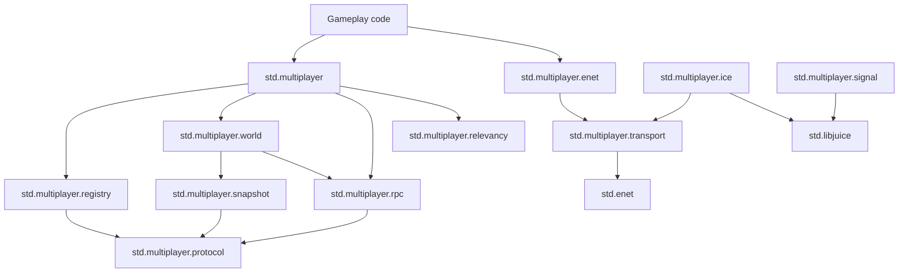

# Multiplayer Standard Library Design

Status: draft design

This document sketches the module layout and public API story for Milk Tea's multiplayer stack.
It assumes the language support described in [Multiplayer Networking Attributes And Compiler Hooks](multiplayer-networking-rfc.md).

The design goal is a small, explicit standard library that feels natural next to `std.net`, `std.net.packet`, and `std.net.channel`:

- ordinary game code should usually import only `std.multiplayer` and one backend such as `std.multiplayer.enet`
- transport-specific details should live below that
- replicated state and typed RPCs should be declared once and reused everywhere
- the escape hatch should stay available for projects that need manual packets or transport access

## Layering



## Public Import Story

Ordinary gameplay code should look like this:

```mt
import std.multiplayer as mp
import std.multiplayer.enet as mp_enet
```

Most projects should not need to import `std.multiplayer.protocol`, `std.multiplayer.transport`, or the lower runtime modules directly.
Those exist for organization, advanced control, and future backends.

## Core Design Rules

1. The root module owns the user-facing vocabulary: IDs, errors, configs, attributes, and descriptor hooks.
2. The runtime is server-authoritative by default.
3. Transport choice is explicit. ENet and future ICE backends are different modules.
4. Matchmaking, lobbies, and cloud services are not bundled into the multiplayer core.
5. When there is a tension between cleverness and obviousness, choose obviousness.

## Module Map

### `std.multiplayer`

Responsibility:
Own the public vocabulary and the compiler-assisted descriptor hooks.

Primary surface:

- `ConnectionId`
- `EntityId`
- `Tick`
- `Authority`
- `TransferMode`
- `SyncTarget`
- `RpcDirection`
- `ErrorCode`
- `Error`
- `Config`
- `RpcContext`
- `StateDescriptor`
- `RpcDescriptor`
- `Registry`
- `World`
- `state_descriptor[T]()`
- `rpc_descriptor(callable_of(...))`
- `@[replicated(...)]`
- `@[sync(...)]`
- `@[rpc(...)]`

Notes:

- This module should re-export `Registry` and `World` from submodules so ordinary users do not need to memorize the runtime layout.
- Default configuration helpers should live here.
- Backend constructors such as `listen(...)` and `connect(...)` do not belong here.

### `std.multiplayer.registry`

Responsibility:
Collect replicated-state and RPC descriptors into one immutable protocol description.

Primary types:

- `Registry`
- `StateRegistration`
- `RpcRegistration`

Primary functions and methods:

- `Registry.create() -> Registry`
- `Registry.add_state(descriptor: StateDescriptor) -> Result[bool, Error]`
- `Registry.add_rpc(descriptor: RpcDescriptor) -> Result[bool, Error]`
- `Registry.freeze() -> Result[bool, Error]`
- `Registry.protocol_hash() -> ulong`

Notes:

- `freeze()` should sort or otherwise stabilize the final registration order so the same source program produces the same protocol hash.
- The registry is the one place where both sides agree on the multiplayer schema.

### `std.multiplayer.world`

Responsibility:
Own replicated entities, local authority information, and the current world snapshot.

Primary types:

- `World`
- `WorldRole`
- `EntityRecord`
- `Ownership`

Primary functions and methods:

- `World.create(registry: Registry, config: Config, role: WorldRole) -> Result[World, Error]`
- `World.spawn[T](state: T, owner: ConnectionId?) -> Result[EntityId, Error]`
- `World.despawn(entity: EntityId) -> Result[bool, Error]`
- `World.transfer_ownership(entity: EntityId, owner: ConnectionId?) -> Result[bool, Error]`
- `World.state_ref[T](entity: EntityId) -> ref[T]?`
- `World.state_copy[T](entity: EntityId) -> Option[T]`

Notes:

- V1 should compute state deltas by comparing current state to the last acknowledged baseline instead of relying on hidden dirty-bit mutation tracking.
- `state_ref[T](...)` is acceptable in this model because runtime diffing happens later at snapshot time.
- Client worlds own interpolation buffers and last-authoritative copies internally.

### `std.multiplayer.rpc`

Responsibility:
Queue, encode, decode, and dispatch typed RPC traffic.

Primary types:

- `OutgoingRpc`
- `IncomingRpc`
- `DispatchError`

Primary functions and methods:

- `encode_outgoing(...)`
- `decode_incoming(...)`
- `dispatch(...)`

User-facing convenience methods should eventually live on backend sessions:

- `Client.send_rpc(...)`
- `Server.send_rpc_to(...)`
- `Server.broadcast_rpc(...)`

Notes:

- The first implementation should keep the sending side descriptor-driven and explicit until the descriptor and dispatch core is stable.
- V1 does not commit the final typed wrapper signature for those convenience methods yet.
- Any later `callable_of(...)` sugar should remain ordinary library ergonomics rather than a new v1 compiler hook.
- RPC delivery policy is carried by the descriptor and enforced by the backend.

### `std.multiplayer.snapshot`

Responsibility:
Build and apply replicated state snapshots.

Primary types:

- `SnapshotHeader`
- `BaselineId`
- `AckWindow`
- `InterpolationBuffer`

Primary functions and methods:

- `encode_spawn(...)`
- `encode_despawn(...)`
- `encode_state_delta(...)`
- `apply_spawn(...)`
- `apply_despawn(...)`
- `apply_state_delta(...)`

Notes:

- This module is mostly runtime plumbing and should remain fairly low-level.
- V1 should prioritize correctness and obviousness over heavy compression tricks.

### `std.multiplayer.relevancy`

Responsibility:
Decide which entities are relevant to which connections.

Primary types:

- `Policy`
- `Decision`
- `Filter`

Primary functions and methods:

- `always()`
- `owner_only()`
- `callback(filter: fn(connection: ConnectionId, entity: EntityId) -> bool) -> Policy`

Future extensions:

- spatial grid policies
- radius-based policies
- team-based policies

Notes:

- V1 should start with owner-only, always, and callback policies.
- More advanced spatial structures should come only after the base runtime is proven.

### `std.multiplayer.protocol`

Responsibility:
Define on-the-wire message kinds and shared packet framing.

Primary types:

- `PacketKind`
- `HandshakeHello`
- `HandshakeWelcome`
- `HandshakeReject`
- `SnapshotPacketHeader`
- `RpcPacketHeader`

Notes:

- This module should be transport-neutral.
- It should not know or care whether bytes are moving over ENet, ICE, or a future transport.
- Handshake messages must carry the registry protocol hash.

### `std.multiplayer.transport`

Responsibility:
Define the minimal backend-neutral driver contract used by the world and RPC layers.

Primary types:

- `Driver`
- `DriverEvent`
- `DriverPacket`
- `PeerToken`

Notes:

- This module is an internal seam more than a public gameplay API.
- It should be small enough that ENet and future ICE backends can both implement it without inventing a second world runtime.

### `std.multiplayer.enet`

Responsibility:
Provide the first concrete multiplayer backend using `std.enet`.

Primary types:

- `Server`
- `Client`
- `SessionEvent`

Primary functions:

- `listen(address: enet.Address, peer_count: ptr_uint, channel_limit: ptr_uint, registry: mp.Registry, config: mp.Config) -> Result[Server, mp.Error]`
- `connect(address: enet.Address, channel_count: ptr_uint, registry: mp.Registry, config: mp.Config) -> Result[Client, mp.Error]`

Primary methods:

- `world() -> ref[mp.World]`
- `pump(timeout_ms: uint) -> Result[ptr_uint, mp.Error]`
- `flush() -> void`
- `release() -> void`
- `send_rpc(...)` convenience wrappers once the base runtime is stable

Notes:

- ENet is the first backend because it already gives Milk Tea channels, reliable and unreliable delivery, peer lifecycle, throttling, and a game-oriented service loop.
- The first implementation should prioritize dedicated-server and remote-client flow.
- Listen-server convenience can be added after the dedicated path is stable.

### `std.multiplayer.signal`

Responsibility:
Hold signaling helpers for future ICE/libjuice sessions.

Primary types:

- `Offer`
- `Answer`
- `Candidate`
- `SignalMessage`

Notes:

- This module is future-facing and should not block the first ENet backend.
- It exists to keep ICE signaling explicitly outside the transport-neutral runtime core.

### `std.multiplayer.ice`

Responsibility:
Provide a future libjuice-backed backend for NAT-traversed sessions.

Notes:

- This backend should share the same registry, world, snapshot, RPC, and protocol layers as `std.multiplayer.enet`.
- It should not force ENet through libjuice.

### `std.multiplayer.testkit`

Responsibility:
Provide deterministic helpers for runtime tests.

Potential contents:

- loopback transport
- packet capture helpers
- protocol mismatch fixtures
- fake tick advancement helpers

Notes:

- The first runtime tests may use real localhost ENet sessions directly.
- A dedicated testkit becomes worthwhile once multiple backends exist.

## Friendly User Story

The intended user flow should stay small:

```mt
import std.multiplayer as mp
import std.multiplayer.enet as mp_enet

@[mp.replicated(authority = mp.Authority.server)]
struct PlayerState:
    @[mp.sync(mode = mp.TransferMode.unreliable_ordered, channel = 0, rate_hz = 30, target = mp.SyncTarget.observers)]
    position: math.Vec3

    @[mp.sync(mode = mp.TransferMode.reliable, channel = 0, rate_hz = 0, target = mp.SyncTarget.observers)]
    health: int


@[mp.rpc(direction = mp.RpcDirection.to_server, mode = mp.TransferMode.unreliable_ordered, channel = 1, require_owner = true)]
function submit_input(context: mp.RpcContext, entity: mp.EntityId, input: PlayerInput) -> void:
    ...


function build_registry() -> mp.Registry:
    var registry = mp.Registry.create()
    let _ = registry.add_state(mp.state_descriptor[PlayerState]()) else:
        fatal(c"state registration failed")
    let _ = registry.add_rpc(mp.rpc_descriptor(callable_of(submit_input))) else:
        fatal(c"rpc registration failed")
    return registry
```

The ordinary gameplay module should not need to know how snapshot headers are laid out or how ENet peers are keyed internally.

## V1 Boundary

The first useful user-facing slice should include at least this much:

- `std.multiplayer`
- `std.multiplayer.registry`
- `std.multiplayer.world`
- `std.multiplayer.protocol`
- `std.multiplayer.rpc`
- `std.multiplayer.snapshot`
- `std.multiplayer.relevancy`
- `std.multiplayer.enet`

Internal support seams such as `std.multiplayer.transport` may still land in the same implementation series if they keep the backend-neutral runtime cleaner, but ordinary gameplay code should not need them.
