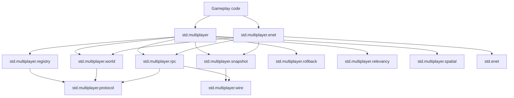

# Multiplayer Standard Library Design

Status: finalized (implemented)

This document describes the current multiplayer standard-library layout as implemented.
It is no longer a proposal.

## Implemented Layering



## Public Import Story

Typical gameplay imports:

```mt
import std.multiplayer as mp
import std.multiplayer.enet as mp_enet
```

## Implemented Modules

### `std.multiplayer`

Public root vocabulary and compiler-lowered hook declarations.

Exports include:

- ids and enums (`ConnectionId`, `EntityId`, `Authority`, `TransferMode`, `RpcDirection`, ...)
- core types (`Config`, `Error`, `Registry`, `World`, descriptor aliases)
- ergonomic binding builder (`BindingsBuilder.create()`, `bind_state[T](...)`, `bind_rpc(...)`, `bind_typed_rpc(...)`)
- attributes (`replicated`, `sync_defaults`, `sync`, `rpc`)
- hook surface (`state_descriptor`, `rpc_descriptor`, `state_wire_size`, `rpc_payload_size`)

### `std.multiplayer.registry`

Descriptor collection and protocol hash agreement.

Implemented API highlights:

- `Registry.create()`
- `add_state(...)`, `add_rpc(...)`
- `freeze()`
- `protocol_hash()`
- descriptor binding checks (`expected_state_*`, `expected_rpc_*`)

For gameplay code that does not want to wire descriptors manually, prefer `std.multiplayer.BindingsBuilder` plus `bind_state`, `bind_rpc`, and `bind_typed_rpc`, then pass `builder.registry` and `builder.typed_rpcs` into the backend/session setup that needs them.

### `std.multiplayer.world`

Entity storage, ownership, snapshot payload encoding/decoding, and descriptor-aware state access.

Implemented API highlights:

- `World.create(...)`
- `spawn[T](...)`, `spawn_with_descriptor[T](...)`
- `despawn(...)`, `transfer_ownership(...)`
- `state_ptr[T](...)`, `state_ptr_with_descriptor[T](...)`
- `state_copy[T](...)`, `state_copy_with_descriptor[T](...)`
- `snapshot_state_signature(...)`
- `prepare_snapshot(tick, baseline_tick)`
- `encode_snapshot_payload()` / `apply_snapshot_payload(...)`

### `std.multiplayer.rpc`

RPC packet framing, queueing, descriptor-backed dispatch, and typed dispatch hook target.

Implemented API highlights:

- `RpcDispatchTable.create()`, `register_route(...)`, `dispatch(...)`
- `dispatch_with_routes(...)`
- `dispatch_typed_payload(callable_of(...), context, payload)` compiler-lowered path
- shared typed inbound queue drain helper used by ENet and ICE session wrappers
- `encode_header(...)`, `decode_header(...)`, `build_payload(...)`
- incoming queue helpers

### `std.multiplayer.snapshot`

Snapshot signatures, baseline tracking, packet header encode/decode, and incoming queue helpers.

### `std.multiplayer.rollback`

Explicit rollback/prediction history primitives.

Implemented API highlights:

- `History[T].create(max_frames)`
- `record(tick, value)` with explicit nondecreasing-tick validation
- `find(tick)`, `oldest()`, `latest()`
- `discard_before(...)`, `discard_after(...)`
- `resimulate_from(states, inputs, authoritative_tick, step)` for explicit replay from a known authoritative state

This module is intentionally an explicit prediction/rollback toolbox, not a hidden netcode runtime. Callers still choose when to capture input/state, when to discard future prediction, when to replay, and how to step simulation during replay.

Concrete gameplay-style correction flow:

```mt
import std.multiplayer.rollback as rollback

type PlayerPosition = int
type MoveInput = int

function apply_move(state: PlayerPosition, input: MoveInput) -> PlayerPosition:
    return state + input

var state_history = rollback.History[PlayerPosition].create(8)
var input_history = rollback.History[MoveInput].create(8)

let _ = state_history.record(200, 10) else:
    fatal(c"failed to record base state")
let _ = state_history.record(201, 20) else:
    fatal(c"failed to record corrected authoritative state")

let _ = input_history.record(202, 6) else:
    fatal(c"failed to record input")
let _ = input_history.record(203, -2) else:
    fatal(c"failed to record input")

# If later prediction already filled future frames, trim them before rewriting an
# older authoritative tick.
let _ = state_history.discard_after(201)
let replayed = rollback.resimulate_from(ref_of(state_history), ref_of(input_history), 201, apply_move) else:
    fatal(c"rollback replay failed")

# state_history now contains corrected frames for ticks 202 and 203.
```

### `std.multiplayer.relevancy`

Implemented policies and checks:

- `all()`, `owner()`, `callback(...)`
- `grid(...)`, `owner_or_grid(...)`, `owner_or_grid_index(...)`
- `allows(...)`

### `std.multiplayer.spatial`

Grid indexing and helper math for relevancy-driven policies.

### `std.multiplayer.wire`

Shared big-endian primitives (`u32`/`u64`) used by protocol framing.

### `std.multiplayer.protocol`

Protocol/shared types and scheduling primitives.

Implemented API highlights:

- packet and handshake structs
- tick scheduler (`create_tick_scheduler`, `reserve`, `remaining_bytes`, ...)
- budget plan (`create_tick_budget_plan`)

### `std.multiplayer.enet`

Current concrete backend.

Implemented types:

- `Server`, `Client`
- `SessionEvent`, `SessionEventRecord`
- `WeightedConnection`
- `TypedRpcRoute`, `TypedRpcDispatchTable`

Implemented capabilities include:

- host/client setup (`listen`, `connect`, localhost helpers)
- protocol verification handshake
- event pump/flush/release lifecycle
- snapshot and RPC incoming queue draining (`process_incoming_snapshots`, `process_incoming_rpcs_typed`) backed by shared world/RPC queue-drain utilities
- explicit send helpers (`send_snapshot_to`, `send_rpc_to`, `broadcast_snapshot`, `broadcast_rpc`)
- fair/weighted/budgeted scheduling helpers
- gameplay-facing fair tick dispatch (`dispatch_tick_fair`, which encodes snapshot bytes from the current world state internally)
- lower-level pre-encoded fair tick dispatch (`dispatch_preencoded_tick_fair`) for runtimes that already own snapshot headers and payload bytes
- explicit world snapshot preparation via `World.prepare_snapshot(...)`, which returns owned header/signature/payload data for reuse across send paths without hidden caching

### `std.multiplayer.enet_sync`

Small observer-state helpers layered over `std.multiplayer.enet`.

Implemented API highlights:

- `ObserverStateSync[T].create(...)`
- `broadcast_observer_state(...)`
- `drain_observer_state(...)`
- `drain_observer_state_with_info(...)`, which also returns the latest authoritative snapshot tick drained from the queue

This layer is intentionally small. It helps simple observer-style replication without hiding snapshot headers or inventing a larger session abstraction.

## Behavioral Boundaries (Current)

1. Networking send paths are explicit runtime calls.
2. Compiler annotations do not rewrite ordinary gameplay calls into network sends.
3. Protocol compatibility is enforced through registry protocol hash checks.
4. Session lifecycle is exposed through queued events plus low-level queue accessors.

## Internet Play Boundary

Matchmaking/lobby/discovery are outside the core multiplayer runtime.

Direct public-IP join remains an ENet + UDP forwarding/firewall concern in user applications.
Dedicated public servers and manually forwarded host sessions are the supported internet-facing model in the current runtime.

Current prioritization after the latest cleanup:

1. Done: explicit prepared-snapshot surface for reusable world snapshot encoding.
2. In progress: explicit rollback history and replay primitives in `std.multiplayer.rollback`.
3. Deferred by design: transport-neutral session abstractions or internet matchmaking/service layers outside direct ENet runtime concerns.

Lobby/matchmaking remains outside the core runtime boundary. The repo still has no truthful backend/storage/discovery contract to implement against, so stdlib should not pretend to provide a service layer yet.

## Existing Runtime Coverage

Primary coverage files:

- `test/std/std_multiplayer_world_test.rb`
- `test/std/std_multiplayer_world_snapshot_signature_test.rb`
- `test/std/std_multiplayer_snapshot_runtime_test.rb`
- `test/std/std_multiplayer_relevancy_test.rb`
- `test/std/std_multiplayer_enet_test.rb`
- `test/std/std_multiplayer_enet_friendly_api_test.rb`
- `test/std/std_multiplayer_enet_fair_budget_test.rb`
- `test/std/std_multiplayer_enet_scheduled_fair_test.rb`
- `test/std/std_multiplayer_enet_world_dispatch_signature_test.rb`
- `test/std/std_multiplayer_enet_snapshot_baseline_test.rb`
- `test/std/std_multiplayer_enet_maturity_soak_test.rb`
- `test/std/std_multiplayer_enet_stress_test.rb`
- `test/std/std_multiplayer_rollback_test.rb`
